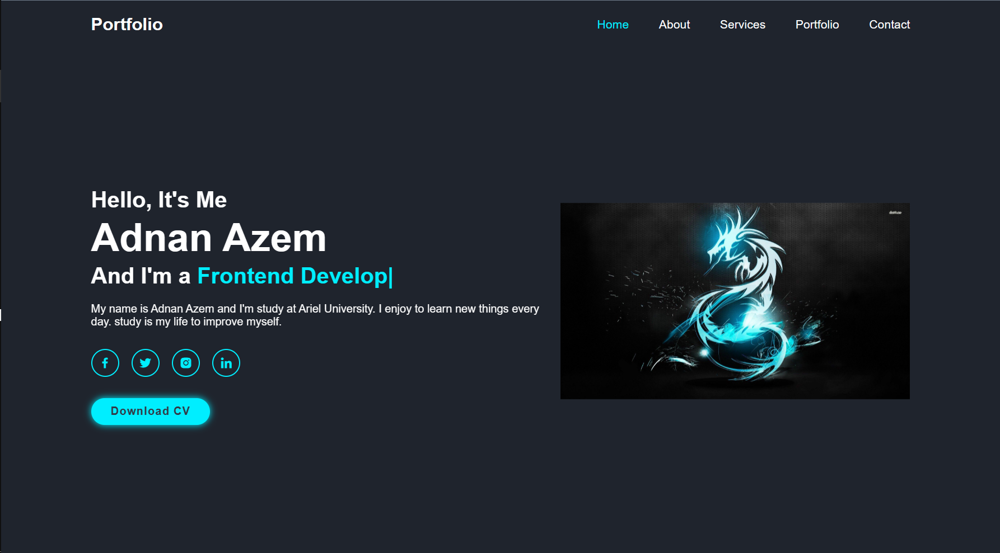
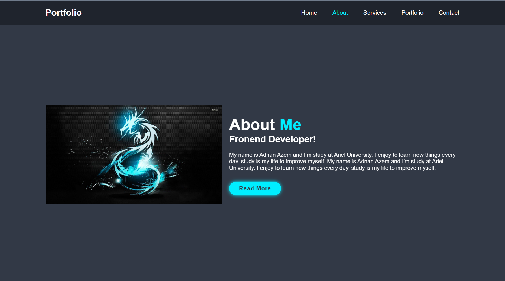
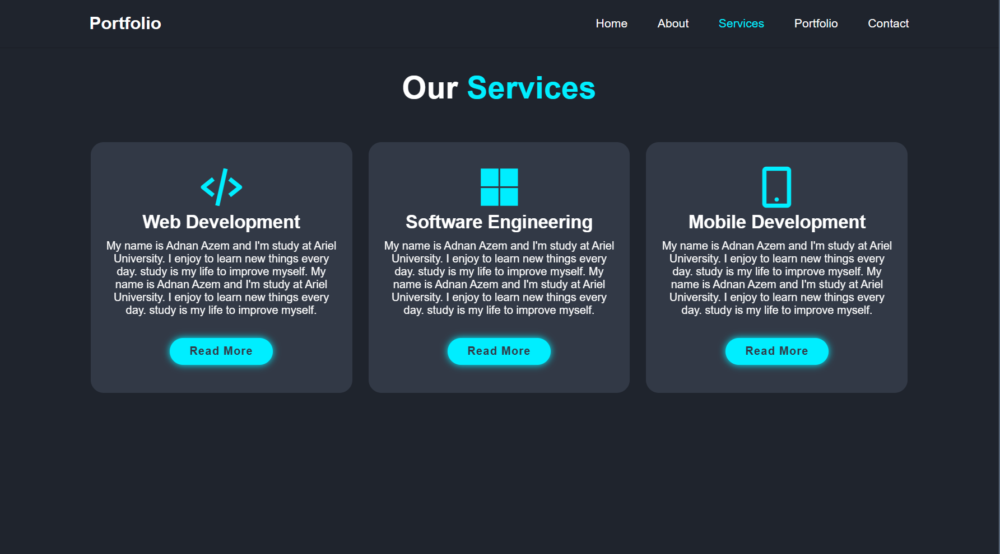
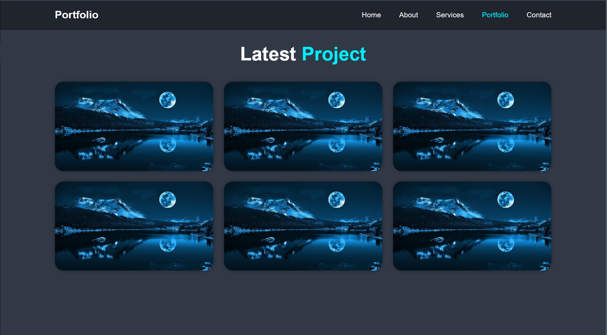
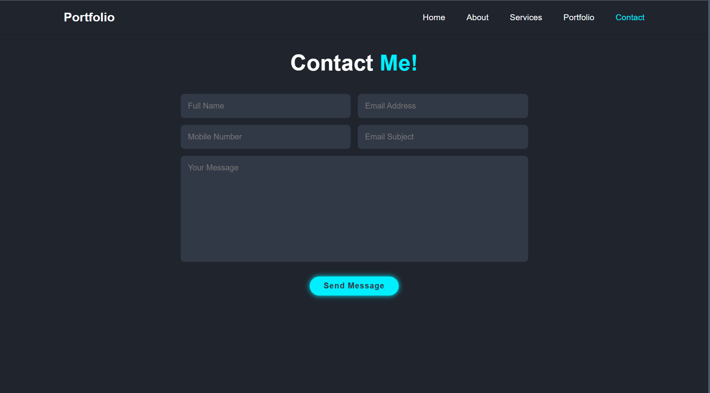

# Responsive-Personal-Website-Design

<h2>In this project I design a frontend personal website </h2>
<h4>You can see pictures of the website below: </h4>

<h3>Home Page: </h3>

<h3>About Page: </h3>

<h3>Services Page: </h3>

<h3>Portfolio Page: </h3>

<h3>Contact Page: </h3>
